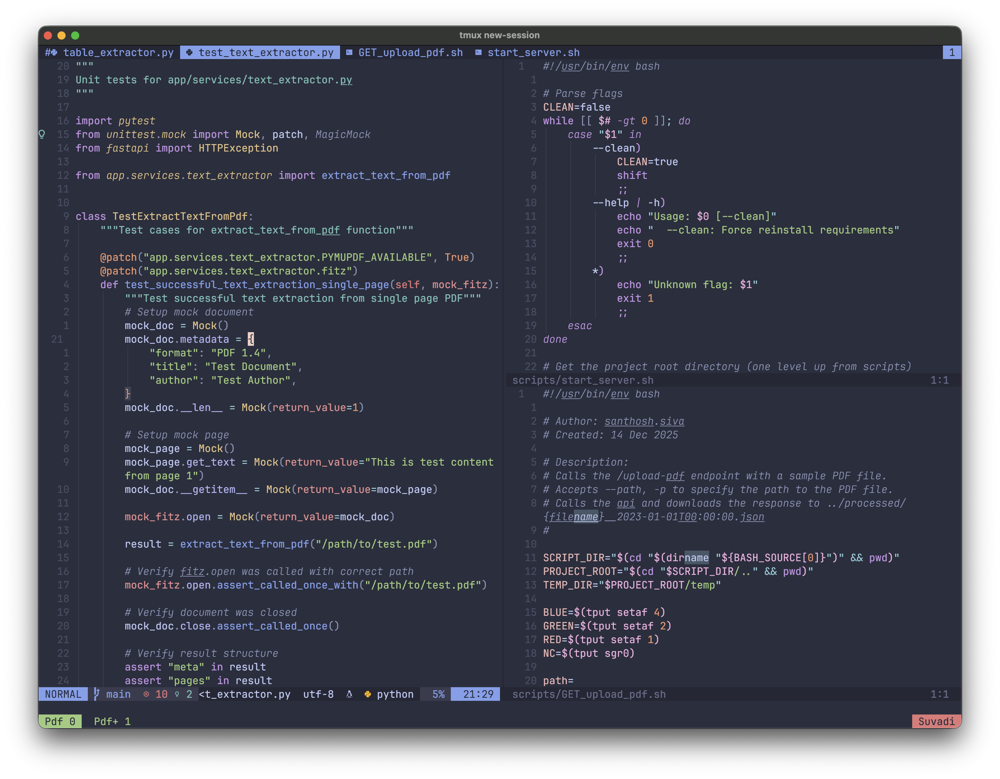

# My Dotfiles

Personal dotfiles and development environment configuration for macOS. Features organized configs, automated setup scripts, and a collection of productivity utilities.


*Tmux + Neovim setup with Catppuccin theme and Powerlevel10k*

## Structure

```
.
├── assets/                      # Static assets
│   ├── catppuccin_*.zsh         # Zsh syntax highlighting themes
│   ├── JetBrainsMonoPatched.zip # Nerd Font for terminal
│   └── terminal-setup.png       # Terminal setup screenshot
├── bin/                         # Custom scripts and utilities
│   ├── android/                 # Android development scripts
│   │   ├── adb-install          # Install React Native apps
│   │   ├── adb-reverse          # Port forwarding setup
│   │   ├── adb-uninstall        # Uninstall apps from device
│   │   └── wireless-adb         # Wireless debugging setup
│   ├── dev/                     # Development utilities
│   │   ├── kill-port            # Kill process on specified port
│   │   ├── setup-ssh-agent      # SSH key management
│   │   └── setup/               # Environment setup scripts
│   │       ├── setup-environment      # Install dev tools
│   │       ├── install-global-deps    # Install global packages
│   │       └── link-dotfiles          # Create config symlinks
│   └── utils.sh                 # Shared utility functions
├── configs/                     # Configuration files
│   ├── .eslintrc.json           # ESLint configuration
│   ├── .gitconfig.example       # Git configuration template
│   ├── .gitconfig__wrk.example  # Work-specific git config template
│   ├── .p10k.zsh                # Powerlevel10k theme
│   ├── .prettierrc.json         # Prettier configuration
│   ├── .tmux.conf               # Tmux configuration
│   ├── .vimrc                   # Vim configuration
│   ├── .zshrc                   # Zsh configuration
│   ├── .zshrc_pre               # Zsh pre-configuration (themes)
│   ├── ssh_config.example       # SSH configuration template
│   ├── eslint/                  # ESLint configurations
│   │   ├── eslint.config.ts     # ESLint flat config (modern)
│   │   └── eslint-utilities.ts  # ESLint shared utilities
│   ├── prettier.config.js       # Prettier config (modern)
│   ├── tsconfig.base.json       # TypeScript base config
│   └── tsconfig.json            # TypeScript project config
├── alacritty/                   # Alacritty terminal config
├── fish/                        # Fish shell configuration
├── gitsy/                       # Git workflow automation (submodule)
├── nvim/                        # Neovim configuration
└── LICENSE                      # MIT License
```

## Installation

### Quick Start

1. **Clone this repository with submodules:**
   ```bash
   git clone --recursive https://github.com/san-siva/dotfiles.git ~/.config
   cd ~/.config
   ```

   > **Note:** The `--recursive` flag ensures the `gitsy` submodule is cloned. If you forget it:
   > ```bash
   > git submodule init && git submodule update
   > ```

2. **Create your `~/.zshrc` file:**
   ```bash
   echo "source ~/.config/configs/.zshrc" > ~/.zshrc
   ```

3. **Set up your git and SSH configuration:**
   ```bash
   # Copy the example files
   cp configs/.gitconfig.example configs/.gitconfig
   cp configs/.gitconfig__wrk.example configs/.gitconfig__wrk
   cp configs/ssh_config.example configs/ssh_config

   # Edit with your personal information
   # configs/.gitconfig - Update email and name
   # configs/.gitconfig__wrk - Update work email, name, and signing key paths
   # configs/ssh_config - Update SSH key paths for your GitHub accounts
   ```

   > **Note:** The actual `.gitconfig` and `ssh_config` files are gitignored to protect your credentials from being exposed in the repository.

4. **Run the setup scripts:**
   ```bash
   # Install development environment and tools
   ./bin/dev/setup/setup-environment

   # Install global dependencies (npm, brew, pip packages)
   ./bin/dev/setup/install-global-deps

   # Create symlinks for config files
   ./bin/dev/setup/link-dotfiles
   ```

## Scripts

All scripts follow a consistent structure with a `main()` function and display a "Sankit" banner. They use the shared `utils.sh` library for common operations.

### Android Development Scripts

Located in `bin/android/`:

- **`wireless-adb`** - Enable wireless ADB debugging over WiFi
  ```bash
  wireless-adb
  # Follow prompts to enter port number
  ```

- **`adb-install`** - Install and run React Native app with custom configuration
  ```bash
  adb-install --port=8081 --env=.env.dev --variant=debug
  ```

- **`adb-uninstall`** - Uninstall app from connected Android device
  ```bash
  adb-uninstall --target=com.example.app
  ```

- **`adb-reverse`** - Setup reverse port forwarding for React Native
  ```bash
  adb-reverse --metro-port=8081 --target-port=8081
  ```

### Development Utilities

Located in `bin/dev/`:

- **`kill-port`** - Kill process running on specified port
  ```bash
  kill-port --port=3000
  ```

- **`setup-ssh-agent`** - Silently setup SSH agent and load keys
  - Automatically sources in `.zshrc`
  - Loads personal and work SSH keys
  - Only prints errors/warnings

### Setup Scripts

Located in `bin/dev/setup/`:

- **`setup-environment`** - Install all development tools
  - Installs: Lua, Python, Neovim, Node.js, Yarn, Ruby, Rust, Java, Go, Tmux, Kitty, Oh My Zsh
  - Each function checks if tools are already installed

- **`install-global-deps`** - Install global npm, brew, and pip packages
  - ESLint, Prettier, TypeScript, Jest (with all necessary plugins)
  - ripgrep, fzf, fd, zoxide, jq, yq
  - Symlinks ESLint configs globally to npm lib directory
  - Each function handles its own dependency checks

- **`link-dotfiles`** - Create symlinks from `~/.config/configs/` to home directory
  - Links: `.tmux.conf`, `.vimrc`, `.prettierrc.json`, `.eslintrc.json`, `.p10k.zsh`
  - Links: `.gitconfig`, `.gitconfig__wrk`, `.ssh/config` (must be created from `.example` files first)

### Git Workflow (Gitsy)

Git automation tools in the `gitsy/` submodule. See `gitsy/README.md` for:
- Branch checkout and creation
- Worktree management
- Stash operations
- Remote synchronization

## Configuration Files

All configs are located in `configs/` and automatically linked to your home directory.

### Git Configuration

- **`.gitconfig.example`** - Template for main git configuration
  - Copy to `.gitconfig` and customize with your email/name
  - Auto-includes work config for `~/Documents/Work/` repos
  - Configured for git submodules

- **`.gitconfig__wrk.example`** - Template for work-specific overrides
  - Copy to `.gitconfig__wrk` and customize with your work email
  - GPG commit signing with SSH
  - Update signing key path to match your SSH key location

> **Privacy Note:** The actual `.gitconfig` and `.gitconfig__wrk` files are gitignored to prevent exposing personal email addresses in the repository. Always use the `.example` files as templates.

### SSH Configuration

- **`ssh_config.example`** - Template for SSH configuration
  - Copy to `ssh_config` and customize with your SSH key paths
  - Supports separate GitHub hosts for personal and work accounts
  - Configure `IdentityFile` paths to match your SSH key locations

> **Privacy Note:** The actual `ssh_config` file is gitignored to protect your SSH key paths from being exposed in the repository. Always use the `.example` file as a template.

### Shell Configuration

- **`.zshrc`** - Main Zsh configuration
  - Path management (Homebrew, Go, Cargo, Ruby, Java)
  - NVM integration (silent output)
  - SSH agent setup via dedicated script
  - Zoxide initialization
  - Aliases for common commands

- **`.zshrc_pre`** - Theme and Oh My Zsh setup
  - Loads Catppuccin syntax highlighting
  - Powerlevel10k theme configuration
  - History substring search plugin

- **`.p10k.zsh`** - Powerlevel10k theme customization

### TypeScript / JavaScript

Generic configs suitable for React/Node.js projects:

- **`tsconfig.base.json`** - Base TypeScript configuration with strict settings
- **`tsconfig.json`** - Project-specific TypeScript config
- **`eslint/eslint.config.ts`** - Modern flat ESLint configuration (symlinked globally by setup script)
- **`eslint/eslint-utilities.ts`** - Shared ESLint rules and plugins (symlinked globally by setup script)
  - React, React Hooks, Redux Saga
  - Jest testing rules
  - Import sorting and organization
  - TypeScript strict rules
  - Symlinked to: `$(npm config get prefix)/lib/eslint-configs/`
- **`jest.config.js`** - Jest testing framework configuration

> **Note:** The ESLint configs are automatically symlinked globally when running `install-global-deps`. Any updates to the configs in `~/.config/configs/eslint/` are immediately reflected globally. You can import them in your projects using the path shown during installation.

### Java Development

- **`eclipse-java-google-style.xml`** - Eclipse Java formatter with Google style guide
- **`lombok.jar`** - Lombok library for Java annotation processing

### Code Formatting

- **`prettier.config.js`** - Prettier configuration (4-space tabs, single quotes)
- **`.prettierrc.json`** - Alternative JSON format for compatibility

### Terminal & Editors

- **`.tmux.conf`** - Tmux configuration
- **`.vimrc`** - Vim editor configuration
- **`nvim/`** - Neovim configuration with lazy.nvim package manager
- **`alacritty/`** - Alacritty terminal emulator config
- **`kitty/`** - Kitty terminal configuration

## Script Architecture

All scripts follow a consistent, maintainable pattern:

### Structure

```bash
#!/usr/bin/env bash

# Author: Santhosh Siva
# Date Created: DD-MM-YYYY
# Description: What this script does

source "$(dirname "${BASH_SOURCE[0]}")/../utils.sh"

# Default Values
variable=""

set_flags() {
    # Parse command line arguments
    while [ $# -gt 0 ]; do
        case "$1" in
            -h | --help) show_help ;;
            --option=*) variable="${1#*=}" ;;
            *) echo "Unknown option: $1" && exit 1 ;;
        esac
        shift
    done
}

main() {
    validate_dependencies figlet lolcat  # For banner scripts
    print_banner                         # Shows "Sankit" banner
    set_flags "$@"
    # Script logic here
}

main "$@"
exit 0
```

### Available Utilities (`bin/utils.sh`)

**Display Functions:**
- `print_banner()` - Display ASCII art "Sankit" banner using figlet and lolcat
- `print_message(message, step_number)` - Formatted console output with step numbers
- `indent()` - Indent piped output with "│" prefix

**Dependency Management:**
- `validate_dependencies(cmd1 cmd2 ...)` - Check and auto-install via brew if missing
- `install_dependency(cmd, package)` - Install single package via brew

**User Interaction:**
- `prompt_user(default_yes, message, step)` - Interactive Y/n prompts with color
- `overwrite(message)` - Overwrite previous terminal line

**Utilities:**
- `navigate_to_dir(dir)` - Safely change directory with error handling
- `is_git_repo(dir)` - Check if directory is a git repository
- `check_uncommitted_changes()` - Check if git repo has uncommitted changes

**Color Variables:**
- `$BLUE`, `$GREEN`, `$RED`, `$PROMPT`, `$NC` - Terminal color codes

## Usage Examples

### Development Workflows

**Kill a process on port 3000:**
```bash
kill-port --port=3000
```

**Install and run React Native app:**
```bash
adb-install --port=8081 --env=.env.staging --variant=debug
```

**Setup wireless ADB debugging:**
```bash
wireless-adb
# Enter port when prompted (e.g., 5555)
```

**Setup reverse port forwarding:**
```bash
adb-reverse --metro-port=8081
```

**Uninstall app from device:**
```bash
adb-uninstall --target=com.myapp.debug
```

### Git Workflows (Gitsy)

**Checkout to a branch:**
```bash
g-co --target-branch=feature/new-feature --stash-changes
```

**Create worktree:**
```bash
g-wa --target-branch=hotfix/critical --path=../hotfix-worktree
```

**Delete worktree:**
```bash
g-wr --target-branch=feature/old-feature
```

See `gitsy/README.md` for complete documentation.

## Requirements

### Essential
- **macOS** - Scripts are macOS-specific (uses `brew`, macOS paths)
- **Git** - For cloning and submodule management
- **Zsh** - Default shell (comes with macOS)

### Automatically Installed
The setup scripts will install these if missing:
- **Homebrew** - Package manager for macOS
- **Node.js / npm** - Via NVM (Node Version Manager)
- **Python 3 / pip3** - For Python tools
- **Ruby / gem** - For Ruby packages
- **Rust / cargo** - For Rust tools
- **Go** - For Go tools
- **Java / JDK** - For Java development

### Optional (for banners)
- **figlet** - ASCII art text generation (auto-installed)
- **lolcat** - Rainbow coloring (auto-installed)

## Customization

### For Your Own Use

1. **Fork this repository** on GitHub

2. **Set up your personal git and SSH configuration:**
   ```bash
   cp configs/.gitconfig.example configs/.gitconfig
   cp configs/.gitconfig__wrk.example configs/.gitconfig__wrk
   cp configs/ssh_config.example configs/ssh_config
   ```
   - Edit `configs/.gitconfig` - Change email and name
   - Edit `configs/.gitconfig__wrk` - Set work email and signing key path
   - Edit `configs/ssh_config` - Update SSH key paths for personal/work accounts
   - Update `bin/dev/setup-ssh-agent` - Update SSH key paths

3. **Customize the banner:**
   - Edit `bin/utils.sh` line 69-73
   - Change `figlet -f slant "Sankit"` to your name

4. **Add custom scripts:**
   - Place in `bin/` directory
   - Use the standard script template
   - Source `utils.sh` for helper functions

5. **Modify configurations:**
   - Edit files in `configs/` directory
   - Run `link-dotfiles` to update symlinks

6. **Add custom paths:**
   - Edit `configs/.zshrc` around line 97
   - Add your project directories to PATH

### Work/Personal Separation

The setup supports different git configs based on directory:
- Personal repos: Uses `configs/.gitconfig` (personal email)
- Work repos in `~/Documents/Work/`: Automatically uses `configs/.gitconfig__wrk` (work email with GPG signing)

Both files must be created from their respective `.example` templates to protect your personal information from being committed to the repository.

## License

MIT License - See LICENSE file for details

## Credits

- Author: Santhosh Siva
- Inspired by the dotfiles community
