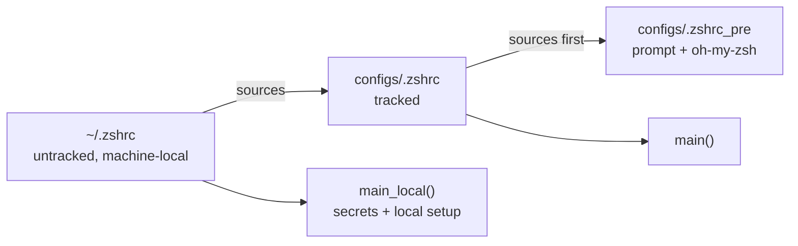

A comprehensive macOS development environment managed as a git repository cloned directly to `~/.config`. Because all XDG-compliant tools look in `~/.config` by default, every config file is automatically in the right place with no extra symlinking needed.

The setup includes a full Neovim IDE configuration, Kitty terminal, Zsh shell config, global Git settings, ESLint / Prettier / TypeScript configs, and a collection of utility shell scripts for daily development.

> [!NOTE]
>
> **Theme:** The entire environment uses the **Catppuccin Frappé** color palette — Neovim, Kitty, and all terminal tools are configured to match.

## Directory Structure

All configuration lives under `~/.config`:

| Path       | Description                                                    |
| ---------- | -------------------------------------------------------------- |
| `nvim/`    | Neovim configuration (init.lua + Lua modules)                  |
| `kitty/`   | Kitty terminal — fonts, theme, window settings                 |
| `fish/`    | Fish shell — minimal PATH additions                            |
| `configs/` | Home-dir dotfiles (`.zshrc`, `.gitconfig`, `.tmux.conf`, etc.) |
| `bin/`     | Shell utility scripts (`android/`, `dev/`, `utils.sh`)         |
| `git/`     | Global git config and gitignore                                |
| `assets/`  | Screenshots, patched fonts, theme files                        |

> [!TIP]
>
> **XDG compliant:** Cloning to `~/.config` means tools like Neovim, Kitty, Fish, and gh pick up their configs automatically without any manual linking.

## Requirements

| Tool                      | Purpose                                 |
| ------------------------- | --------------------------------------- |
| `neovim 0.10+`            | Editor (required for all nvim features) |
| `node 18+ / nvm`          | JavaScript tooling, LSP servers         |
| `git`                     | Version control                         |
| `kitty`                   | Terminal emulator                       |
| `zsh`                     | Primary shell                           |
| `brew`                    | macOS package manager — installed by `setup-environment` if missing |
| `JetBrainsMono Nerd Font` | Font (all terminals + Neovim)           |

## Installation

Clone the repository directly to `~/.config`:

```bash
# Clone directly to ~/.config (XDG base dir)
git clone https://github.com/san-siva/dotfiles ~/.config

# If ~/.config already exists
cd ~/.config
git init
git remote add origin https://github.com/san-siva/dotfiles
git pull origin main
```

Three setup scripts handle the full environment bootstrap. Run them in order, or use `setup-environment` to run all three at once.

### setup-environment

The top-level bootstrapper. Installs Homebrew first if it is missing and puts it on PATH for the rest of the run, then installs all system tools and delegates to `install-global-deps` and `link-dotfiles`.

```bash
~/.config/bin/dev/setup/setup-environment
```

| Category          | Installs                                                                                        |
| ----------------- | ----------------------------------------------------------------------------------------------- |
| Languages         | `python3`, `node` (via nvm), `ruby`, `go`, `lua`, `rust`                                        |
| Java              | `openjdk`, `openjdk@21`, `ant`, `maven`, `jdtls`, `google-java-format`                          |
| Editor / Terminal | `neovim`, `kitty`, `tmux` + TPM                                                                 |
| Shell             | `oh-my-zsh`, `powerlevel10k`, `zsh-history-substring-search`                                    |
| CLI tools         | `bash` 5, `ripgrep`, `fzf`, `fd`, `zoxide`, `jq`, `yq`, `gh`, `fish`, `deno`, `wget`, `tree`, `fastfetch` |
| Formatters        | `black` (Python), `sqlfluff`, `shfmt` (via Go), `stylua` (via Cargo)                            |

### install-global-deps

Installs all global npm packages, symlinks ESLint configs, and enables Corepack. Safe to re-run.

```bash
~/.config/bin/dev/setup/install-global-deps
```

| Category       | Packages                                                                                                             |
| -------------- | -------------------------------------------------------------------------------------------------------------------- |
| ESLint core    | `eslint`, `eslint_d`, `jiti`, `@eslint/js`, `@eslint/eslintrc`, `@eslint/compat`                                     |
| ESLint plugins | `eslint-plugin-react`, `-react-hooks`, `-jest`, `-import`, `-redux-saga`, `-unicorn`, `simple-import-sort`, and more |
| TypeScript     | `typescript`, `typescript-eslint`, `@typescript-eslint/eslint-plugin`, `@typescript-eslint/parser`                   |
| Prettier       | `prettier`, `eslint-config-prettier`                                                                                 |
| Testing        | `jest`, `markdownlint-cli2`                                                                                          |
| Tools          | `@san-siva/gitsy`, `@anthropic-ai/claude-code`, `local-ssl-proxy`, `neovim` (npm provider)                           |
| ESLint configs | Symlinks `eslint.config.ts` and `eslint-utilities.ts` into the npm global prefix                                     |

### link-dotfiles

Creates symlinks from `~/.config/configs/` into the home directory using `ln -sfn`, so re-running it is safe: existing files and symlinks at each target are replaced in place. It also links private agent skills from `WORK_AGENT_SKILLS_DIR` when that variable is set — see [Private skills](#private-skills).

```bash
~/.config/bin/dev/setup/link-dotfiles
```

| Source                                     | Symlinked to              |
| ------------------------------------------ | ------------------------- |
| `configs/.tmux.conf`                       | `~/.tmux.conf`            |
| `configs/.prettierrc.json`                 | `~/.prettierrc.json`      |
| `configs/.eslintrc.json`                   | `~/.eslintrc.json`        |
| `configs/.p10k.zsh`                        | `~/.p10k.zsh`             |
| `configs/.gitconfig`                       | `~/.gitconfig`            |
| `configs/.gitconfig__wrk`                  | `~/.gitconfig__wrk`       |
| `configs/ssh_config`                       | `~/.ssh/config`           |
| `configs/eclipse-java-google-style.xml`    | `~/.local/share/eclipse/` |
| `configs/lombok.jar`                       | `~/.local/share/eclipse/` |
| `configs/agent-skills`                     | `~/.claude/skills`        |
| `configs/agent-skills`                     | `~/.gemini/antigravity-cli/skills` |
| `$WORK_AGENT_SKILLS_DIR/*`                 | `configs/agent-skills/<skill>` |
| `configs/antigravity-keybindings.json`     | `~/.gemini/antigravity-cli/keybindings.json` |

> [!WARNING]
>
> Existing files and symlinks at the target paths are replaced. A real directory at a target is moved aside to `<target>.bak-<timestamp>` rather than deleted — review and remove these backups once you have checked their contents.

### Create the local zshrc

`link-dotfiles` doesn't create `~/.zshrc` — it's a machine-local file that holds secrets (see [Shell](#shell)). Create it once so new shells load the tracked config:

```bash
echo 'source ~/.config/configs/.zshrc' > ~/.zshrc
```

## Neovim

A full IDE experience built in Lua using [lazy.nvim](https://github.com/folke/lazy.nvim). Entry point is `nvim/init.lua`; leader key is `,`.

```bash
nvim/
├── init.lua                   Entry point — options, loads bindings & plugins
├── lua/
│   ├── bindings/
│   │   ├── mappings.lua       Key mappings
│   │   └── autocmd.lua        Autocommands
│   ├── core/
│   │   └── large-files.lua    Large file detection & feature toggling
│   ├── plugins/
│   │   ├── init.lua           Plugin list (lazy.nvim)
│   │   ├── lspconfig.lua      LSP server configs
│   │   ├── conform.lua        Format-on-save setup
│   │   └── ...
│   ├── shared_ftplugins/
│   │   └── javascript.lua     Shared JS/TS ftplugin (reads prettier tabWidth)
│   └── utils/
│       ├── large-file-check.lua
│       └── wildignores.lua
└── ftplugin/
    ├── typescript.lua
    ├── javascript.lua
    ├── typescriptreact.lua
    ├── javascriptreact.lua
    ├── md.lua
    ├── python.lua
    └── java.lua
```

> [!NOTE]
>
> Set `NVIM_NPM=1` to open Neovim with all plugins disabled — useful when invoked inside Node.js scripts or tooling where startup time matters.

### Key Bindings

| Binding                     | Action                           |
| --------------------------- | -------------------------------- |
| `<C-c>`                     | Escape / cancel                  |
| `<Esc>`                     | Clear search highlight           |
| `<leader>tl` / `<leader>th` | Next / prev tab                  |
| `<leader>tL` / `<leader>tH` | New / close tab                  |
| `<leader>1`–9               | Jump to tab by number            |
| `<leader>bb`                | Alternate buffer                 |
| `<leader>p`                 | Copy relative path + line number |
| `<leader>P`                 | Copy absolute path               |
| `<leader>l`                 | Copy line number                 |
| `<leader>e` / `<leader>E`   | Float diagnostic / loclist       |
| `[e` / `]e`                 | Next / prev diagnostic           |
| `<leader>N` / `<leader>n`   | Toggle relative numbers          |
| `<leader>S`                 | Reload vimrc                     |
| `<leader>M`                 | Delete all marks                 |
| `<leader>ff`                | Telescope: find files            |
| `<leader>fg`                | Telescope: live grep             |
| `<leader>fb`                | Telescope: open buffers          |
| `<leader>fd`                | Telescope: diagnostics           |
| `<leader>tt`                | Toggle file tree                 |
| `<leader>gs`                | Git status                       |
| `<leader>gc`                | Git commit                       |
| `<leader>gh` / `<leader>gl` | Diffget ours / theirs            |
| `<leader>cJ` / `<leader>cK` | Open / close all folds           |
| `<C-o>`                     | Supermaven: accept suggestion    |
| `<C-y>`                     | Supermaven: accept word          |
| `<C-r>`                     | Supermaven: dismiss              |

### Autocommands

| Event                       | Action                                                                       |
| --------------------------- | ---------------------------------------------------------------------------- |
| `TextYankPost`              | Flash-highlight yanked text                                                  |
| `BufReadPre`                | Detect large files; set hash-based undo path for long file paths             |
| `BufReadPost`               | Disable swapfile, undofile, syntax, synmaxcol, treesitter for large files    |
| `BufWinEnter`               | Disable folding, cursorline, spell for large files                           |
| `BufReadPre` / `BufNewFile` | Read prettier tabWidth from config and set local indentation for JS/TS files |

### Plugins

| Plugin                     | Purpose                                          |
| -------------------------- | ------------------------------------------------ |
| `catppuccin/nvim`          | Colorscheme — Frappé flavor                      |
| `nvim-treesitter`          | Syntax highlighting + text objects               |
| `nvim-lspconfig` + `mason` | LSP server management                            |
| `conform.nvim`             | Format on save                                   |
| `nvim-cmp` + `luasnip`     | Completion — LSP, snippets, path, dictionary     |
| `telescope.nvim`           | Fuzzy finder — files, grep, buffers, diagnostics |
| `nvim-tree.lua`            | File explorer sidebar                            |
| `gitsigns.nvim`            | Git diff signs in gutter                         |
| `vim-fugitive`             | Git commands inside Neovim                       |
| `supermaven-nvim`          | AI inline completion                             |
| `nvim-ufo`                 | Code folding via LSP / treesitter                |
| `lualine.nvim`             | Status line + buffer tabline                     |
| `indent-blankline.nvim`    | Indent guides                                    |
| `nvim-colorizer.lua`       | Hex/CSS color preview                            |
| `markdown-preview.nvim`    | Live browser preview with Mermaid                |
| `nvim-jdtls`               | Java LSP (Eclipse JDT)                           |
| `todo-comments.nvim`       | TODO / FIXME highlighting                        |
| `Comment.nvim`             | Comment toggling                                 |
| `fidget.nvim`              | LSP progress spinner                             |

### Language Support

| Language                            | LSP            | Formatter             |
| ----------------------------------- | -------------- | --------------------- |
| TypeScript / JavaScript             | `ts_ls`        | `prettier`            |
| ESLint diagnostics                  | `eslint`       | —                     |
| Go                                  | `gopls`        | `goimports` + `gofmt` |
| Python                              | `basedpyright` | `isort` + `black`     |
| Lua                                 | `lua_ls`       | `stylua`              |
| Bash                                | `bashls`       | `shfmt`               |
| TailwindCSS                         | `tailwindcss`  | —                     |
| Java                                | `nvim-jdtls`   | `google-java-format`  |
| CSS / SCSS / HTML / JSON / Markdown | —              | `prettier`            |
| SQL                                 | —              | `sqlfmt`              |
| XML                                 | —              | `xmllint`             |
| YAML                                | —              | `yamllint`            |

> [!NOTE]
>
> **Monorepo TypeScript:** `ts_ls` walks up the directory tree to find the topmost directory containing both `tsconfig.json` and `node_modules` — works correctly in monorepos without per-project config.

## Shell

The Zsh config is split into three layers so the tracked parts stay portable and secrets never touch the repo.


```mermaid
graph LR
  A["~/.zshrc<br/>untracked, machine-local"] -->|sources| B["configs/.zshrc<br/>tracked"]
  B -->|sources first| C["configs/.zshrc_pre<br/>prompt + oh-my-zsh"]
  B --> D["main()"]
  A --> E["main_local()<br/>secrets + local setup"]
```

| File                 | Tracked | Responsibility                                                               |
| -------------------- | ------- | ---------------------------------------------------------------------------- |
| `~/.zshrc`           | No      | Entry point plus machine-local `setup_*` functions for secrets and tooling   |
| `configs/.zshrc`     | Yes     | PATH, language toolchains, integrations, keybindings, aliases                |
| `configs/.zshrc_pre` | Yes     | Catppuccin syntax highlighting, Powerlevel10k instant prompt, oh-my-zsh load |

### Machine-local entry point

`~/.zshrc` isn't symlinked. It's a plain file that sources the tracked config, then follows the same pattern — one `setup_*` function per concern and a `main_local()` that calls them — for anything that must stay off GitHub:

```bash
# ~/.zshrc
source ~/.config/configs/.zshrc

setup_env_vars() {
    # Secrets — not tracked in any repo
    export JIRA_API_TOKEN="..."
    export FIGMA_API_TOKEN="..."
}

setup_local_paths() {
    export PATH="$HOME/.local/some-tool/bin:$PATH"
}

setup_local_aliases() {
    alias work='cd ~/Work'
}

main_local() {
    setup_env_vars
    setup_local_paths
    setup_local_aliases
}

main_local
```

> [!TIP]
>
> **Avoid name clashes:** The tracked config already defines `main` and `setup_aliases`, so local functions use distinct names such as `main_local` and `setup_local_aliases`.

> [!IMPORTANT]
>
> **Keep secrets in `~/.zshrc` only.** Everything under `~/.config` is pushed to a public repository.

### One function per concern

Instead of one long script, `configs/.zshrc` groups each concern into its own `setup_*` function, and a single `main()` calls them in order. Reordering, disabling, or debugging a step is a one-line change:

```bash
# configs/.zshrc
main() {
    setup_environment_variables
    setup_homebrew_paths
    setup_go_environment
    setup_rust_environment
    setup_ruby_environment
    setup_python_environment
    setup_java_environment
    setup_custom_bins
    setup_node_environment
    setup_shell_integrations
    setup_keybindings
    setup_ssh_agent
    setup_aliases
}

main
```

| Function                      | Responsibility                                                         |
| ----------------------------- | ---------------------------------------------------------------------- |
| `setup_environment_variables` | `TERM`, `EDITOR`, `VISUAL`                                             |
| `setup_homebrew_paths`        | Homebrew `bin` / `sbin` and Rancher Desktop                            |
| `setup_go_environment`        | `GOPATH` and `~/go/bin`                                                |
| `setup_rust_environment`      | `~/.cargo/bin`                                                         |
| `setup_ruby_environment`      | Homebrew Ruby, compiler flags, user gem bin                            |
| `setup_python_environment`    | Python user-base `bin`                                                 |
| `setup_java_environment`      | OpenJDK, Zulu 8, `JAVA_HOME`                                           |
| `setup_custom_bins`           | `~/.local/bin`, `~/bin`, and the `bin/` script folders in this repo    |
| `setup_node_environment`      | nvm, Yarn global bin, Zscaler CA for Node tooling                      |
| `setup_shell_integrations`    | zoxide — runs after PATH is complete                                   |
| `setup_keybindings`           | `^n` / `^p` completion, `^j` / `^k` history substring search           |
| `setup_ssh_agent`             | Loads keys via `bin/dev/setup-ssh-agent`                               |
| `setup_aliases`               | `sed` → `gsed`, gh copilot shortcuts, navigation aliases               |

### Safe PATH handling

PATH is built through two guarded helpers. A directory is only added if it exists, and `typeset -aU path` keeps entries unique, so re-sourcing the file never produces duplicates. The same config works on a machine that's missing some toolchains:

```bash
# configs/.zshrc
typeset -aU path

prepend_path() {
    if [ -d "$1" ]; then
        path=("$1" $path)
    fi
}

append_path() {
    if [ -d "$1" ]; then
        path=($path "$1")
    fi
}
```

## Terminal

### Kitty

Config at `kitty/kitty.conf`. Kitty is the primary terminal — configured for a clean, distraction-free experience with the full Catppuccin Frappé color scheme.

| Setting     | Value                                    |
| ----------- | ---------------------------------------- |
| Font        | `JetBrainsMono Nerd Font Mono`, 13pt     |
| Theme       | Catppuccin Frappé (`themes/frappe.conf`) |
| Window size | `150c × 50c`                             |
| Cursor      | `block`                                  |
| Option key  | `macos_option_as_alt yes`                |

> [!TIP]
>
> **Switching themes:** All four Catppuccin flavors are in `kitty/themes/` — change the `include` line to `latte.conf`, `macchiato.conf`, or `mocha.conf` to switch.

### Tmux

Config at `configs/.tmux.conf` (symlinked to `~/.tmux.conf`). Uses [TPM](https://github.com/tmux-plugins/tpm) for plugin management with Catppuccin-matching status bar colors.

| Setting           | Value                                           |
| ----------------- | ----------------------------------------------- |
| Prefix            | `C-a`                                           |
| Mouse             | Enabled                                         |
| History limit     | `10000`                                         |
| Pane navigation   | `prefix + h/j/k/l` (vim-style)                  |
| Window navigation | `prefix + i/u` (next/prev), `prefix + p` (last) |

| Plugin           | Purpose                                   |
| ---------------- | ----------------------------------------- |
| `tmux-resurrect` | Save and restore sessions across restarts |
| `tmux-yank`      | Copy to system clipboard from tmux        |

## Git

| Topic               | Description                                                                                                                                                                                          |
| ------------------- | ---------------------------------------------------------------------------------------------------------------------------------------------------------------------------------------------------- |
| Multi Account Setup | Personal and work profiles with separate SSH keys using `includeIf` and SSH host aliases — [blog post](https://santhoshsiva.dev/blog/the-ultimate-guide-to-managing-multiple-git-accounts-ssh-keys/) |
| Gitsy               | Terminal UI for Git — log, diff, branch, and stash views — [gitsy.santhoshsiva.dev](https://gitsy.santhoshsiva.dev/?section=overview)                                                                |

## Agent Skills

A shared set of AI agent skills lives in `configs/agent-skills/`. `link-dotfiles` symlinks the same directory into both Claude Code (`~/.claude/skills`) and Antigravity CLI (`~/.gemini/antigravity-cli/skills`), so one edit updates both agents.

```bash
configs/agent-skills/
├── <skill-name>/
│   ├── SKILL.md       Frontmatter (name, description) + instructions
│   └── references/    Optional supporting docs loaded on demand
└── ...
```

| Skill                 | Description                                                                         |
| --------------------- | ----------------------------------------------------------------------------------- |
| `add-logs`            | Add log statements in the `SAN_SIVA` logging format                                 |
| `bash-scripts`        | Write bash scripts in the gitsy style — sourced utils, `set_flags` parsing, etc.    |
| `branch-name`         | Suggest a git branch name for a Jira ticket                                         |
| `commit-and-push`     | Suggest commit messages, pick one, then commit and push                             |
| `commit-message`      | Suggest a Conventional Commits message for the staged changes                       |
| `create-markdown`     | Write markdown following a consistent style guide, including blogkit-md rules       |
| `create-worktree`     | Create a git worktree using `g-wa`                                                  |
| `document-progress`   | Record task progress into `~/Work/TASKS`                                            |
| `gitsy`               | Perform Git operations through the gitsy CLI                                        |
| `mermaid-wizard`      | Produce syntactically correct Mermaid diagrams for code, architecture, and flows    |

### Private skills

Work-specific skills live in a separate private repository, not here. `link-dotfiles` reads their location from `WORK_AGENT_SKILLS_DIR` — set in the untracked `~/.zshrc` — and symlinks each one into `configs/agent-skills/`, which is gitignored. If the variable is unset, the step is skipped.

```bash
# ~/.zshrc
setup_env_vars() {
    export WORK_AGENT_SKILLS_DIR="$HOME/path/to/private/agent-skills"
}
```

> [!TIP]
>
> **Invoking skills:** User-invocable skills can be run directly as slash commands, e.g. `/commit-and-push`. Agents also pick them up automatically when a request matches the skill's description.

## Utility Scripts

All scripts in `bin/` are on PATH and share a common utility library at `bin/utils.sh`.

| Script                    | Category | Description                                    |
| ------------------------- | -------- | ---------------------------------------------- |
| `wireless-adb <ip>`       | Android  | Connect to a device over WiFi                  |
| `adb-install <apk>`       | Android  | Install APK to connected device                |
| `adb-reverse <port>`      | Android  | Reverse a port (e.g. Metro bundler)            |
| `adb-uninstall <package>` | Android  | Uninstall a package by name                    |
| `kill-port <port>`        | Dev      | Kill the process listening on a given port     |
| `setup-ssh-agent`         | Dev      | Load SSH key into the running agent            |
| `pwdc`                    | Dev      | Print current working directory (clean output) |
| `reinstall-claude`        | Dev      | Reinstall Claude Code CLI tool                 |
| `reinstall-npm-pkg <pkg> [version]` | Dev | Reinstall/upgrade any global npm package |

## Assets

The `assets/` directory contains static resources:

| Asset                      | Description                                     |
| -------------------------- | ----------------------------------------------- |
| `screenshot.png`           | Environment screenshot for README               |
| `catppuccin/`              | Catppuccin syntax highlight theme files for Zsh |
| `JetBrainsMonoPatched.zip` | Patched JetBrainsMono with Nerd Font glyphs     |

## License

This project is licensed under the MIT License.

## About

**Author:** [Santhosh Siva](https://santhoshsiva.dev)
**GitHub:** [github.com/san-siva](https://github.com/san-siva)
